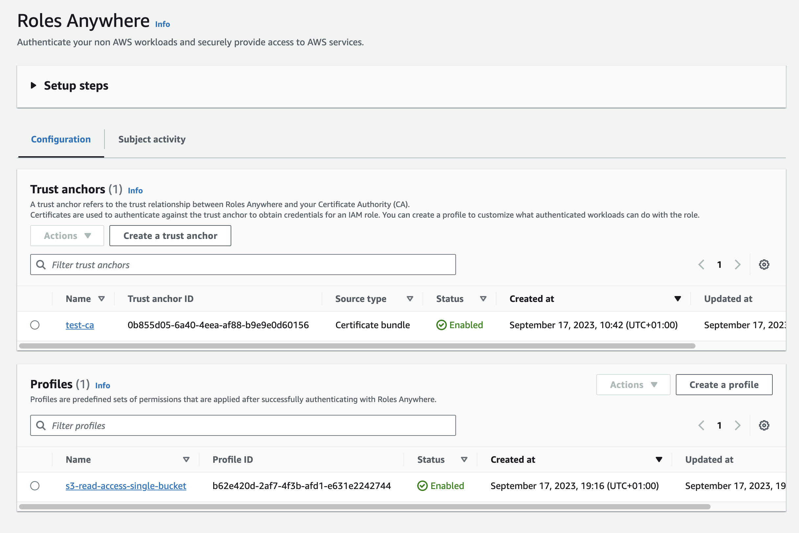
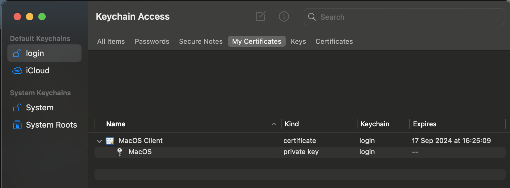

# aws-iam-roles-anywhere
* Create test CA and client certificate locally using Python
* No need to use AWS Private CA
* Configure AWS IAM Roles Anywhere

<kbd>
  
</kbd>


* Configure with MacOS Keychain and test

<kbd>
  
</kbd>

## important warning
The code in this repository is for test purposes only and is not suitable for a production certificate authority. 

A production certificate authority should have its keys generated in a Hardware Security Module (HSM) and it should not be possible to export the private key from the HSM.

With this code, private keys are held locally on disk, and loss of these could potentially lead to takeover of your AWS Accounts.

## set up Python virtual environment
```
python -m venv .venv
source .venv/bin/activate
pip install -r requirements.txt
```

## create test certs
* create self-signed Certificate Authority
* create client certificate
* includes required certificate extensions for AWS IAM Roles Anywhere
```
python main.py
```

## test AWS IAM Roles Anywhere
[Create Trust Anchor](docs/TRUST_ANCHOR.md)  
[Create IAM Role](docs/IAM_ROLE.md)  
[Create Roles Anywhere Profile](docs/PROFILE.md)  
[Test AWS IAM Roles Anywhere](docs/TEST.md)  
[Set up MacOS Keychain](docs/MACOS_KEYCHAIN.md)  
[Test MacOS Keychain](docs/TEST_MACOS.md)  

## acknowledgement
[Medium article by Roy Ben](https://medium.com/cyberark-engineering/calling-aws-services-from-your-on-premises-servers-using-iam-roles-anywhere-3e335ed648be)