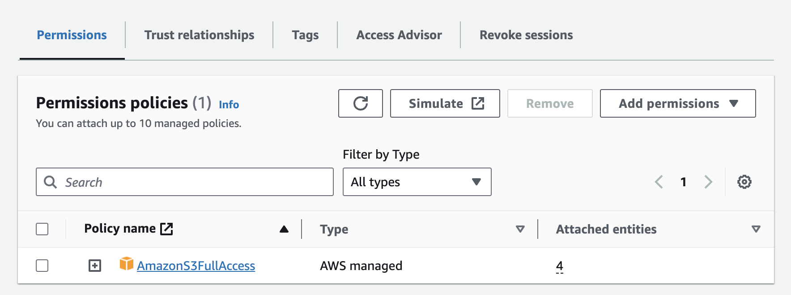

# Create IAM Role
* Select IAM, Roles, Create role
* Select Custom Trust Policy
* Copy and Paste the trust policy below
```json
{
    "Version": "2012-10-17",
    "Statement": [
        {
            "Effect": "Allow",
            "Principal": {
                "Service": "rolesanywhere.amazonaws.com"
            },
            "Action": [
                "sts:AssumeRole",
                "sts:TagSession",
                "sts:SetSourceIdentity"
            ],
            "Condition": {
                "StringEquals": {
                    "aws:PrincipalTag/x509Subject/OU": "Cloud Security"
                }
            }
        }
    ]
}
```
* Press Next
* Select the AWS managed policy `AmazonS3FullAccess`
* This will allow full access to all S3 buckets in your account, we will narrow this down in the next section
* Add a role name, e.g. `roles-anywhere-s3-full-access`

<kbd>
  
</kbd>
