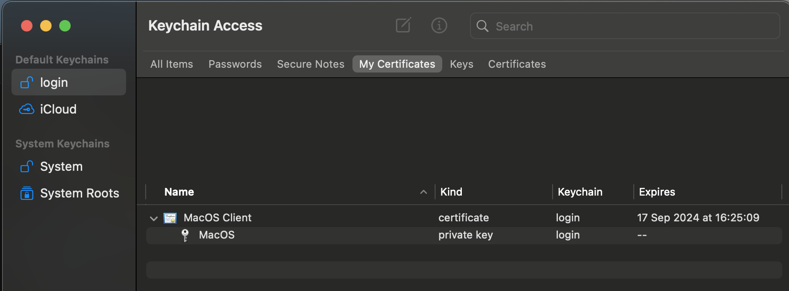

# Key stored in MacOS Keychain
* The AWS Roles Anywhere Credential Helper now supports operating system certificate stores

## Trust Root CA in MacOS Keychain
* In MacOS, Keychain, select the **System** Keychain
* In MacOS, in Finder, locate this repo
* Drag the file `crypto/client/test-ca.pem` into the Certificates tab
* Double click on `Test Company Root CA`

<kbd>
  
</kbd>

* At the first drop down, select `Always Trust`
* Close the window
* Confirm the change to trust settings with your MacOS password
* Reopen to confirm that the changes have taken effect

<kbd>
  
</kbd>

## Create CSR in MacOS Keychain
It's best practice is to create the private / public key pair within MacOS Keychain - then the private key never needs to leave Keychain.
* Open Keychain, from the menu, select Keychain Access, Certificate Assistant, Request Certificate from Certificate Authority
* For test purposes, enter e.g. `test@example.com` for email and e.g. `MacOS` as the client name
* select `Saved to disk` and `Let me specify key pair information`

<kbd>
  
</kbd>

* press Continue
* save the Certificate Signing Request (CSR) file to this repository under `crypto/macos`

<kbd>
  
</kbd>

* leave settings at `2048 bits` key size and `RSA`
* press Continue

<kbd>
  
</kbd>

* the CSR has been created and saved to disk

## Issue MacOS client cert
* in `main.py` change `rebuild_ca` to `False` to prevent rebuilding the CA
* in `main.py` change `macos_cert` to `True` to issue MacOS client cert
* create MacOS client certificate
```
python main.py
```
* ensure the new file is present at `crypto/macos/macos-cert.pem`

## Import MacOS client cert to Keychain
* Open KeyChain and select the **Login** Keychain
* Select the My Certificates tab
* Open Finder, navigate to this repository
* Drag `crypto/macos/macos-client.pem` on to Keychain
* It should now appear in My Certificates

<kbd>
  
</kbd>

* Expand details and note the key associated with the certificate

<kbd>
  
</kbd>
