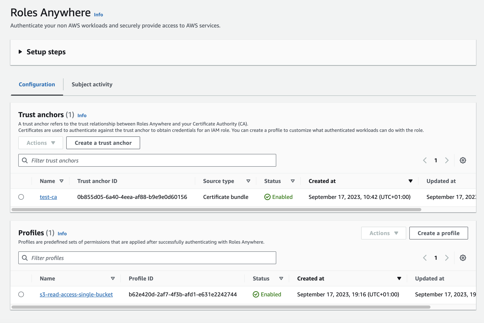

# Create IAM Roles Anywhere Profile
* Search for IAM Roles Anywhere
* This will take you to IAM, Roles, Roles Anywhere
* Create a profile
* Enter a name for the profile, e.g. `s3-read-access-single-bucket`
* Select the role you created earlier
* Copy and Paste the trust policy below
* Replace `<BUCKET_ARN>` with one of your S3 buckets
```
{
  "Version":"2012-10-17",
  "Statement":[
    {
      "Effect":"Deny",
      "Action":"*",
      "NotResource":[
        "<BUCKET ARN>",
        "<BUCKET ARN>/*"
      ]
    }
  ]
}
```
<kbd>
  
</kbd>

* Press Create a Profile
* You will now see both the Trust Anchor and Profile in the Roles Anywhere configuration

<kbd>
  
</kbd>
