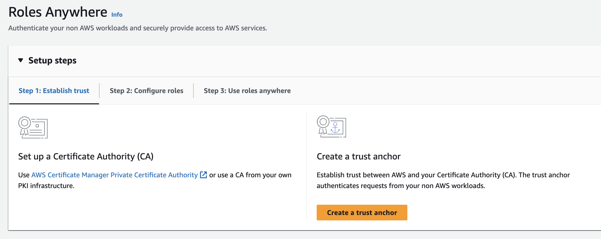
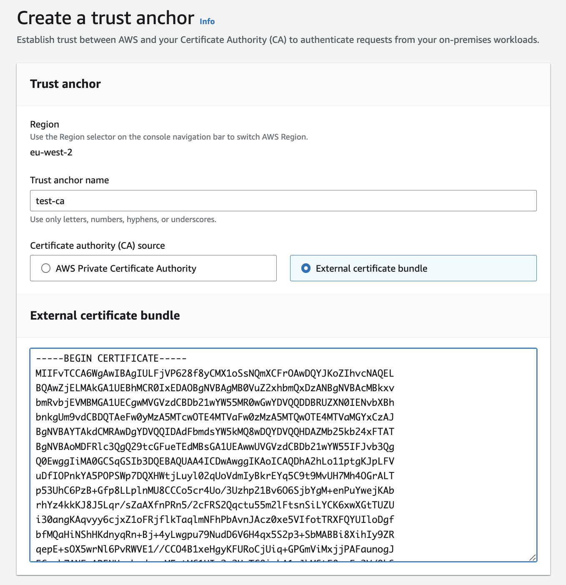
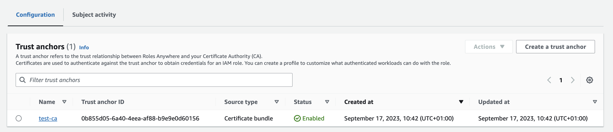

# Create Trust Anchor
* Log in to your AWS account
* Search for IAM Roles Anywhere
* This will take you to IAM, Roles, Roles Anywhere

<kbd>
  
</kbd>

* Create a trust anchor
* Set a name for the trust anchor, e.g. `test-ca`
* Select External certificate bundle
* Paste in the contents of `certs/ca/test-ca.pem`
* Leave notification defaults
* Add tags if desired

<kbd>
  
</kbd>

* Press Create a trust anchor
* Your trust anchor should now be created

<kbd>
  
</kbd>